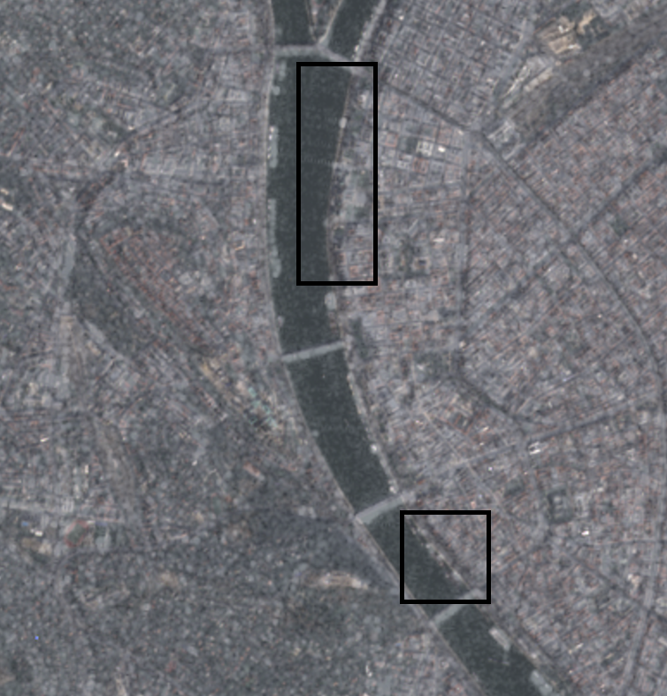
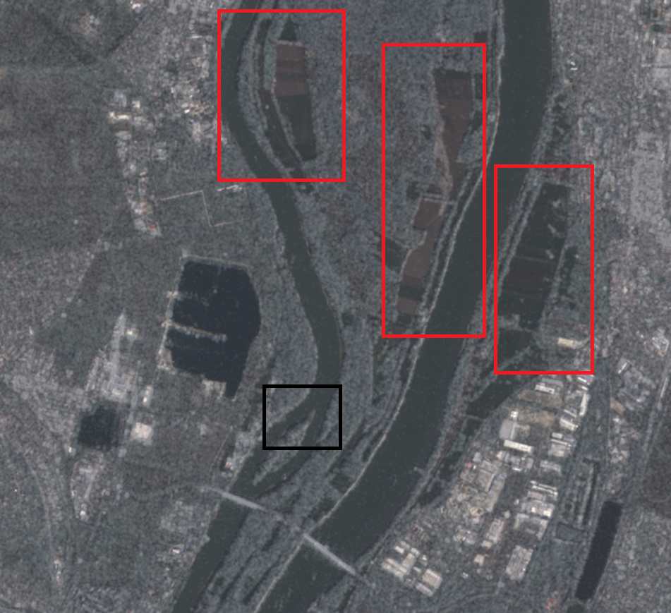

---

### **Operational Guide: Human-Interpretable Flood Mapping Using SAR–Optical Fusion**

> **Author**: Viacheslav Tokarev  
> **Date**: February 2026  
> **Context**: Companion to *Physical Principles for Flood Mapping with VV-Polarized SAR*  
> **GitHub**: [`va-sar/sar-optical-fusion`](https://github.com/va-sar/sar-optical-fusion.git)

---

## 1. The Challenge: All-Weather Situational Awareness

During floods, emergency response teams need timely, actionable maps — but persistent cloud cover often blocks optical satellites like Sentinel-2 for days.  

While Synthetic Aperture Radar (SAR) from Sentinel-1 operates in all weather, its grayscale speckle imagery is not immediately interpretable by professionals whose expertise lies in hydrology, civil protection, or logistics — not radar signal processing.

---

## 2. The Approach: Context-Aware Fusion for Rapid Assessment

This gap is bridged with a simple, open, and automated workflow:

1. **Use the most recent pre-event optical image**  
   - Acquired under clear skies (e.g., Sentinel-2 from 1–31 days before the event)  
   - Provides familiar visual context: roads, buildings, rivers, fields  

2. **Fuse it with a post-event VV-polarized SAR image**  
   - From Sentinel-1 (typically available within 24–48 hours)  
   - Captures surface changes through clouds, rain, or darkness  

3. **Automatically align and overlay**  
   - Using robust deep-learning-based matching (RoMa) with physics-based image preparation (optical image sharpening, SAR radiometric scaling to dB)
   - No ground control points, GPS, or manual georeferencing needed  

4. **Deliver an intuitive composite**

#### Example: Danube Flood Monitoring, Budapest Region (September 2024)

In this real-world scenario, a fall flood along the Danube obscured large parts of Pest under persistent cloud cover. A Sentinel-2 image from seven days prior provides the reference optical context, while a post-event Sentinel-1 VV acquisition captures surface changes through clouds. After automated alignment using robust feature matching, key features are annotated to support rapid interpretation:

  
 
*Black boxes extend the known Danube bank line on the Pest side, providing geometric continuity where optical data is missing.*

  
*Red box highlights a field exhibiting strong darkening in VV-polarized SAR — consistent with calm water inundation of agricultural fields near river.*

 

This fusion enables civil protection and hydrology teams to assess flood extent without SAR expertise, using only open Copernicus data and physics-aware visualization.

---

## 3. Designed for Operational Users — Not SAR Experts

This method is built **for professionals who need clarity**:

- **Civil protection coordinators** can instantly recognize affected neighborhoods  
- **Hydrologists** can validate flood extent against known river basins  
- **Logistics teams** can identify blocked roads without interpreting phase or coherence  

> No InSAR, no polarimetric decomposition, no command-line SAR toolkits  
> Just open data + automated alignment + visual clarity

All inputs are from public Copernicus missions; all code runs in pure Python (NumPy, SciPy, PyTorch) — no proprietary software.

---

## 4. Trade-Off: Speed and Clarity Over Sub-Pixel Precision

| Method | Accuracy | Turnaround | User Accessibility |
|-------|--------|-----------|------------------|
| **InSAR / ML flood masks** | High (cm–m) | Hours to days | Requires SAR expertise |
| **SAR–optical fusion (this method)** | Moderate (~10–30 m) | **<5 minutes** | **Immediate for field teams** |

> **Goal**: Support rapid situational awareness in the critical first 72 hours — not replace scientific-grade mapping.

---

## 5. When to Use This Workflow

Ideal for:
- Rapid flood screening in cloudy regions (e.g., Danube Basin, Central Europe)  
- NGOs or national agencies using open Copernicus data
- Teams needing reproducible, documented workflows without external dependencies  

Limitations:
- Requires a recent cloud-free optical reference   
- Limited precision: 10-20 m along river banks

--- 

> See companion document: [Physical Principles for Flood Mapping with VV-Polarized SAR](../physics/physics_vv_sar.md)

