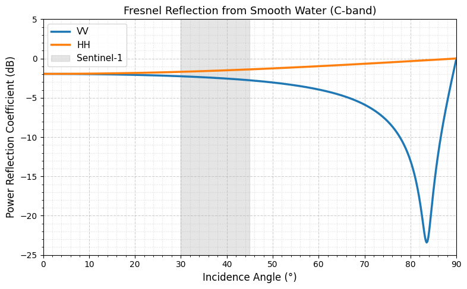

# Physical Principles for Flood Mapping with VV-Polarized SAR

> **Author**: Viacheslav Tokarev  
> **Date**: February 2026  
> **Context**: Supporting documentation for SAR–optical fusion pipeline ([GitHub: `va-sar`](https://github.com/va-sar/sar-optical-fusion.git))

---

## 1. Introduction

In synthetic aperture radar (SAR) remote sensing, flood detection relies on the strong backscatter contrast between smooth water surfaces (which appear dark) and vegetated or urban terrain (which appear bright). This contrast is maximized using **VV-polarized** (vertical transmit, vertical receive) data at moderate incidence angles (30°–50°), as provided by missions like Sentinel-1.

This note explains the electromagnetic basis for this behavior, focusing on:
- Fresnel reflection at dielectric interfaces  
- Polarization dependence (VV vs. HH)  
- The origin of the effective backscatter minimum for water in operational SAR geometries  

---

## 2. Electromagnetic Reflection from Smooth Dielectrics

When a radar wave strikes a smooth surface (e.g., calm water), energy is reflected **specularly**—like a mirror. The fraction of power returned toward the sensor (quantified as the normalized radar cross-section, $\sigma^0$) depends on:

- **Polarization** (VV or HH)  
- **Incidence angle** ($\theta$)  
- **Complex relative permittivity** ($\varepsilon_r$) of the surface  

For an ideal smooth interface, the **Fresnel power reflection coefficients** are:

#### VV (Vertical):
$$
R_{\text{VV}}(\theta) = \left| \frac{\varepsilon_r \cos\theta - \sqrt{\varepsilon_r - \sin^2\theta}}{\varepsilon_r \cos\theta + \sqrt{\varepsilon_r - \sin^2\theta}} \right|^2
$$

#### HH (Horizontal):
$$
R_{\text{HH}}(\theta) = \left| \frac{\cos\theta - \sqrt{\varepsilon_r - \sin^2\theta}}{\cos\theta + \sqrt{\varepsilon_r - \sin^2\theta}} \right|^2
$$

where:
- $\theta$ = incidence angle (measured from nadir)  
- $\varepsilon_r \approx 75 - j21$ = complex relative permittivity of freshwater at C-band (~5.4 GHz)

> **Note**: For a perfectly smooth water surface, $R_{\text{VV}}$ reaches its theoretical minimum near the **Brewster angle** (~84° at C-band). However, in real-world conditions, wind-induced surface roughness shifts the observable $\sigma^0$ minimum to **40°–50°**, aligning with Sentinel-1’s operational range. This effective minimum provides optimal contrast for flood mapping.
  
*Figure 1: Theoretical $R_{\text{VV}}$ and $R_{\text{HH}}$ (in dB) for smooth freshwater ($\varepsilon_r = 75 - j21$).
---

## 3. Practical Backscatter Minimum in Operational SAR

Although the true Brewster angle occurs near 84°, real flooded areas exhibit a **practical $\sigma^0$ minimum at 40°–50°** due to:
- Moderate surface roughness enhancing diffuse scattering  
- Absence of double-bounce mechanisms over open water  
- Sensor noise floor limiting detectability below ~−25 dB  

 Real $\sigma^0$ values over flooded areas are typically 15–25 dB lower due to roughness and system effects, but the relative VV/HH behavior and angular trend remain consistent.*

This minimum is operationally critical:  
- **Flooded fields** → behave like smooth dielectrics → very low $\sigma^0$ in VV  
- **Dry land/vegetation** → higher $\sigma^0$ due to volume and double-bounce scattering  
→ Resulting in high dynamic range for robust flood detection.

---

## 4. Why VV Outperforms HH for Inland Floods

HH polarization lacks a pronounced minimum in the 30°–50° range, yielding poorer water–land contrast:

| Polarization | Water $\sigma^0$ (dB) at 40° | Land $\sigma^0$ (dB) at 40° | Contrast (Δ$\sigma^0$) |
|--------------|------------------------------|-----------------------------|------------------------|
| **VV**       | −25 to −30                   | −10 to −5                   | **15–20 dB**           |
| **HH**       | −15 to −20                   | −8 to −3                    | 7–12 dB                |

> Thus, VV polarization maximizes separability between flooded and non-flooded areas in inland environments.

---

> See companion document: _[Operational Fusion of SAR and Optical Imagery for Flood Response](../operational_guide/operational_guide.md)_.